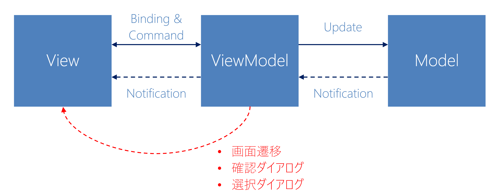

## Prism for Xamarin.Forms
## 入門 Hans-On

+++

## はじめに

+++

### Hands-onの目的

次を理解していただくのが本Hands-onの目的となります。

1. なぜPrismを使うのか？  
    1. 誰がPrismを使うべきか？  
    2. Prismを使うべきではない場合は？  
2. Prismの基本的な機能の利用方法

Note:

本ハンズオンは大きく二つの目的をもって開催しています。

ひとつはXamarin.FormsでPrismを利用する動機を正しく理解していただくことです。
利用に適したケースがどういったケースで、逆に適さないケースがどういったケースなのか理解いただきます。

その上で、実際にPrismを利用してアプリケーションを開発する上で基本的な利用方法を、ハンズオン形式で理解していただきます。

+++

## なぜPrismを使うのか？

Note:

それではまず、なぜPrismを利用すべきなのか？
その動機について説明いたします。

+++

### Prismとは何か？

* XAML Application Framework  
* Guidance  
* Patterns & Practices  
* Testable & Maintainable  
* Open Source  
* .NET Foundation  

Note:

Prismの製作者であるBrian Lagnus氏は次のようにおっしゃっています。  
プリズムはXAMLアプリケーションフレームワークです。  
そして、プリズムはガイダンスであり、パターンやプラクティスの集合でもあります。  
プリズムを使うと、アプリケーションは自然とテストしやすく、変更も容易になります。  

+++

### Prismは何を提供するか？

* MVVM Support
* Commanding
* Messaging
* Navigation
* Page Dialog Service
* Dependency Injection
* Logging

+++

### Xamarin.Formsの最初の悩み  

Xamarin.Formsをつかう  
-> MVVMパターンにしよう  
-> 素のままだとつらい！

+++

### MVVMパターン概要 　

+++

### MVVMパターンの悩みどころ

+++

### なぜPrismを使うか？  

* 「MVVMパターンの悩みどころ」の解決
    * 画面スタックの復元まで考慮された画面遷移サービスの提供 　
    * アラート・確認ダイアログ・アクションシート サービスの提供
* 各種ベストプラクティスの提供 　
    * アプリケーション設計ガイダンスの提供 　
    * 各種パターン・プラクティスの提供 　
    * 結果 -> テスト・メンテナンス容易性の実現

+++

### だれがPrismを使うべきか？  

* MVVMパターンの理解へ不安がある人
* Prismの（特に画面遷移周り）がマッチするアプリケーションの作成者

+++

### Prismを使いべきではないケースは？

* 複雑で特殊な画面遷移が多く、Prismのマッチしないアプリケーションの作成者  
* MVVMパターンの理解が深く、独自のアーキテクチャを採用したい人

+++

## Hands-on Program

1. 事前準備
2. Prismをアプリケーションに適用する
3. ViewModelLocatorを利用してViewModelを適用する
4. BindableBaseを利用する
5. EventToCommandBehaviorを使う
6. 基本の画面遷移
7. Platform Initializer

+++

### Hands-onの流れ

各セクションごとに次の流れで進めます。  

1. 各セクションの目的の共有  
2. テキストに則って作業の実施  
3. 各セクションの振り返り 

+++

## Let’s start Hands-on

[https://github.com/jxug/PrismHandsOn](https://github.com/jxug/PrismHandsOn)
