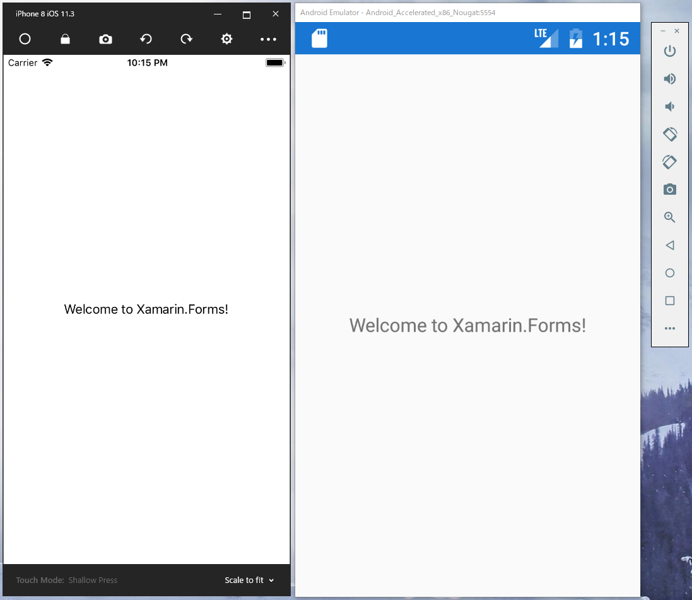

# 事前準備

## 目的

* 素のXamarin.Formsのプロジェクトをビルドし、スタート環境を整える

## 手順

1. 開始状態のコードの取得  
2. プロジェクトをビルドし初期動作の確認  

## 開始状態のコードの取得

本ハンズオンでは、非PrismアプリケーションからPrismを適用しつつ学習をしていきます。

MacとWindowsでテンプレートから作成されるコードが異なるため、つぎのアドレスからソースをクローンもしくはダウンロードしてください。

<font color="C0000#">なお、フォルダの深い位置に置くと、AndroidプロジェクトがWindowsのパスの最大長を超えてしまうため、できるだけ浅い場所に保存してください。</font>

[https://github.com/jxug/PrismHandsOn](https://github.com/jxug/PrismHandsOn)

つぎのコマンドでクローンできます。

```cmd
git clone https://github.com/jxug/PrismHandsOn
```

## プロジェクトをビルドし初期動作の確認  

クローンもしくはダウンロードしたコンテンツから、つぎのパスの「PrismHandsOn.sln」を開いてください。

> PrismHandsOn\src\before

ソリューションを開いたらビルドして実装してください。

次のような画面が表示されたら準備は完了です。



Androidで、次のように表示されたままデバッグが開始されない場合、一度ビルドをキャンセルして再実行してみてください。初回の配置はうまくいかないことが良くあります。

> ～\Xamarin\Mono for Android\debug.keystore" --ks-pass pass:android ～

## 補足説明

なおこのソリューションは、Visual Studio for Windowsのプロジェクト テンプレートから作成したXamarin.Formsのソリューションに次の修正を加えてあります。

* Views / ViewModels / Modelsフォルダの作成  
* MainPageのViewsフォルダへの移動  
* Prism.Autofac.FormsのNuGetからの適用

通常のプロジェクト作成時は、Prism Template Packのプロジェクト テンプレートから作成するため、詳細は気にする必要はありません。

# Next

[Prismをアプリケーションに適用する](02-Prismをアプリケーションに適用する.md)
