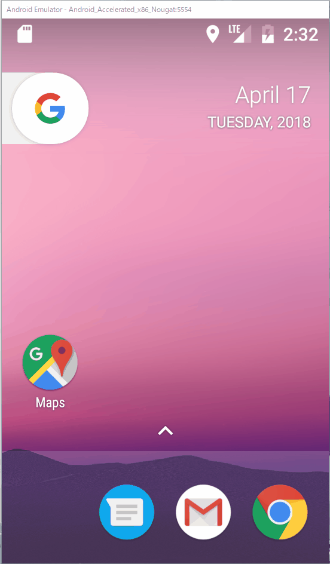

# EventToCommandBehaviorを使う

## 目的

* Commandを直接バインドできないイベントへCommandをバインドする

MVVMパターンを実装しているとよく遭遇する「あるある」に

「特定のイベントが発行されたらViewModelのCommandを実行したいのにCommandがバインドできない！」

というものがあります。

そこでPrismではEventToCommandBehaviorを提供しており、それを利用することで、あらゆるイベントから簡単にCommandを実行できる手段を提供しています。

ここでは、MainPage起動時のAppearingイベント発生時に、画面の表示メッセージを更新するよう実装ます。

## 手順

具体的な手順は次の通りです。

1. MainPageViewModel.csにAppearingイベントに対応するCommandを定義する  
2. MainPage.xamlにEventToCommandBehaviorを定義する

## MainPageViewModel.csにAppearingイベントに対応するCommandを定義する  

MainPageViewModel.csにCommandを定義し、Command実行時にMessageを更新するよう実装します。

```cs
public ICommand AppearingCommand => new Command(() => Message = $"Appearing on {DateTime.Now}");
```

## MainPage.xamlにEventToCommandBehaviorを定義する

つづいてPageのAppearingイベント発生時に、AppearingCommandを実行するよう、MainPage.xamlを更新します。

ContentPageの属性に「xmlns:behaviors=～」の宣言を追加するのを忘れないように注意しましょう。

変更前
```xml
<?xml version="1.0" encoding="utf-8" ?>
<ContentPage xmlns="http://xamarin.com/schemas/2014/forms"
             xmlns:x="http://schemas.microsoft.com/winfx/2009/xaml"
             xmlns:local="clr-namespace:PrismHandsOn"
             x:Class="PrismHandsOn.Views.MainPage">
             ...
```

変更後
```xml
<?xml version="1.0" encoding="utf-8" ?>
<ContentPage xmlns="http://xamarin.com/schemas/2014/forms"
             xmlns:x="http://schemas.microsoft.com/winfx/2009/xaml"
             xmlns:local="clr-namespace:PrismHandsOn"
             xmlns:behaviors="clr-namespace:Prism.Behaviors;assembly=Prism.Forms"
             x:Class="PrismHandsOn.Views.MainPage">
    <ContentPage.Behaviors>
        <behaviors:EventToCommandBehavior EventName="Appearing" Command="{Binding AppearingCommand}"/>
    </ContentPage.Behaviors>
    ...
```

ContentPageにEventToCommandBehaviorが追記され、EventNameにAppearingが、CommandにUpdateMessageCommandが設定されているのが見て取れるでしょう。


それでは実行してみましょう。「Appearing on ～」と表示されれば実装は成功です。



# Next

[NavigationPageの適用](06-01-NavigationPageの適用.md)  